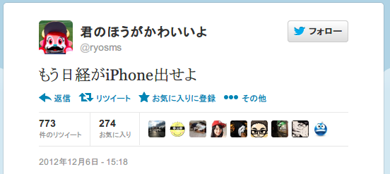

# OSO2013

subtitle
:   AndroidAnnotationsの紹介

author
:   @ryosms

date
:   2013/05/11

theme
:    rabbit

# 自己紹介

* [@ryosms](https://twitter.com/ryosms)
* 日本Androidの会 岡山支部
* 岡山Gitユーザ会([#okagit](https://twitter.com/search/realtime?q=%23okagit&src=typd))代表
	* [http://okagit.github.io/](http://okagit.github.io/)
* OSO2013実行委員

# 自己紹介

* ベストツイート

{:relative_width="70" reflect_ratio='0.5'}

# OSO2012

* JavaFX on Android

* というあおりでJavaFX Script
* 中身はvisage
	* [https://code.google.com/p/visage/](https://code.google.com/p/visage/)

	* そういえば：Java Day Tokyoのセッションにvisageという文字が

# OSO2012

* findViewById書くのめんどくさいねん

	* Button hoge = (Button) findViewById(R.id.hoge);
	* findViewById(R.id.hage).setOnClickListener(this);

# Android Annotations

* [http://androidannotations.org/](http://androidannotations.org/)
* Code Diet
* ＼カターンゼン／

# 使い方

* 公式読め
	* [https://github.com/excilys/androidannotations/wiki/Configuration](https://github.com/excilys/androidannotations/wiki/Configuration)
* annotation processorを有効に
* Annotation付けたらおｋ

# Annotation一覧（一部）

* components
	* @EActivity / @EFragment など
* Injection
	* @AfterViews / @VeiwById など

# Annotation一覧（一部）

* Event binding
	* @Click / @TextChangeなど

* Rest API
	* @RestService / @Getなど

# Annotation一覧

* 他にもいろいろあるよ！
* 詳しくは公式で！
	* [https://github.com/excilys/androidannotations/wiki/AvailableAnnotations](https://github.com/excilys/androidannotations/wiki/AvailableAnnotations)

# 非同期処理

Androidでの非同期処理の歴史

# ～Android2.3

* UIスレッドで重い処理行うとANRが出るよ！
	* 重い処理にはAsyncTask使おうね！
	* UIと密なのがいやだったら自分でThreadとか駆使してね！

# Android4.0～

* 時代はAsyncTaskLoader
	* LoaderではUI操作しないけど、CallbackするからUI操作が必要ならそこでやってね
	* Android 3.x？なにそれおいしいの？

# Android4.0〜

* 1画面で複数のAsyncTaskLoader使いたいならinterfaceとか駆使してね！
	* →例： [http://blog.livedoor.jp/ryosms/archives/5712827.html](http://blog.livedoor.jp/ryosms/archives/5712827.html)

# Android Annotations

* 非同期で実行するメソッドに@Background付ければおｋ
* UIの操作がやりたいなら@UiThread付ければおｋ
	* あら簡単！

# まとめ

* 便利だよ
* 簡単だよ
* 今までの苦労はなんだったのか

	* ※Android初心者に見せたら「Webに載ってるサンプルコードとあまりにも違いすぎる！」って発狂してたよ

# おしまい

* ご静聴ありがとうございました

{:relative_height='90' reflect_ratio='0.5'}

